## Benthic composition and relief for horizontally facing imagery

We have developed a simple approach to characterise benthic composition and complexity from horizontally facing imagery (including stereo-BRUVs and panoramic drop cameras), adapting existing standardised schema for benthic composition ([CATAMI classification scheme](https://github.com/catami/catami.github.com/blob/master/catami-docs/CATAMI%20class_PDFGuide_V4_20141218.pdf)) and benthic complexity <a href="https://paperpile.com/c/0wnItn/M1vE">1</a>.

The annotation approach is rapid and produces point annotation-level composition and mean and standard deviation estimates of complexity, which enable flexible modelling of habitat occurrence and fish-habitat relationships.

This github repository contains:

* A [TransectMeasure](https://github.com/GlobalArchiveManual/forward-facing-habitat-annotation/blob/master/seagis.com.au) Standard Operating Procedures (below)
* A [script](https://github.com/BrookeGibbons/forward-facing-habitat-annotation/blob/master/01_format-dot-point-measurements.R):
    * to check the exports from TransectMeasure against a metadata *.csv
    * to convert the raw TransectMeasure annotations into a tidy dataset.
* Example [broad ](https://github.com/BrookeGibbons/forward-facing-habitat-annotation/blob/master/TM%20schema_BROAD%20ONLY.txt)schema file with only broad attributes
* Example standard schema file with broad, morphology and type attributes
* Example [detailed schema](https://github.com/BrookeGibbons/forward-facing-habitat-annotation/blob/master/TM%20schema_BROAD.MORPH.TYPE.txt) text file with broad, morphology, type and fine attributes

#### Standard Operating Procedure

#### 1. Load images and attribute file

* Open the program TransectMeasure and you will be welcomed with a blank screen (Figure 1).
* To start an analysis for a new set of images: “Measurement” > “New measurement file” (Figure 2). Select “Read from file ...”.
* Locate the folder where your images have been stored: “Picture” > “Set picture directory ...” (Figure 3).
* Load the first image to be analysed: “Picture” > “Load picture ...” (Figure 3).
    * Retake images if they are unfocused and blurry or when visibility is low.
    * For stereo-BRUV imagery, left images are annotated, and for panoramic drop camera imagery, top images are annotated.
* To load the attribute file containing all of the CATAMI habitat classification codes: “Measurements” > “Load attribute file ...” > The attribute file is a text file containing the information necessary for populating the drop down tabs when classifying your image (Figure 4).

##### Figure 1: TransectMeasure initial opening screen. 

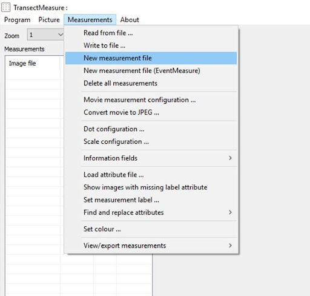
##### Figure 2: Creating a new measurement file in TransectMeasure.

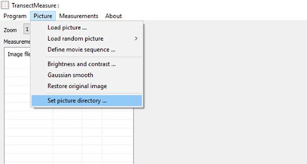
##### Figure 3: Setting the picture directory and loading the image in TransectMeasure.

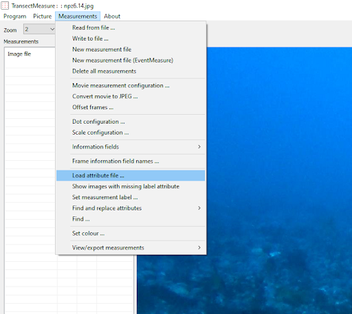
##### Figure 4: Loading the attribute file in TransectMeasure.

#### 2. Setting and overlaying the grid

* To set up the area of interest: Hold shift and left click on the four corners of the rectangle that forms the lower 50% of the image > Right click > “Add new area of interest” (Figure 5). 
* To set up the points: “Measurements” > “Dot configuration ...”. Set accordingly: Random dots, ‘Number of dots’ = 20 and uncheck the “Overlay rectangles” box (Figure 6). This will allow you to classify the benthic composition according to 20 randomly generated points over the lower 50% of the screen. You should only need to change these settings the first time you use the program on your computer.
* To overlay the points: Right click on an image and select “Overlay dots” (Figure 7). The name of the image will then appear in the table to the left of the image. For all subsequent images, you will need to first right click and select “Use last area of interest” before adding dots to ensure that random points are only added to the lower 50% of the image (Figure 8). 

NOTE: To annotate composite imagery, multiple areas of interest will need to be added corresponding to the images contained in the composite image, with points added to imagery after specifying areas of interest using “cntrl+ right click” > “Add dots” > “Add to the existing points” (Figure 9).

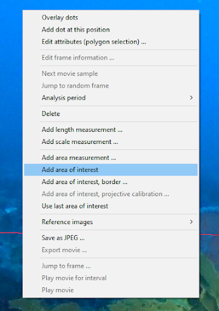
##### Figure 5: Adding a new area of interest in TransectMeasure.

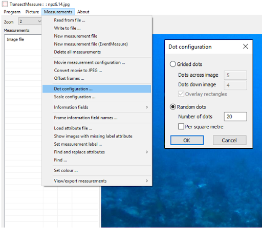
##### Figure 6: Setting the dot configuration in TransectMeasure.

##### Figure 7: Adding dots in TransectMeasure.

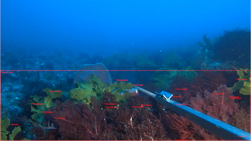
##### Figure 8: Example of a stereo-BRUV image with random points added to the lower 50% of the image ready for annotation. 

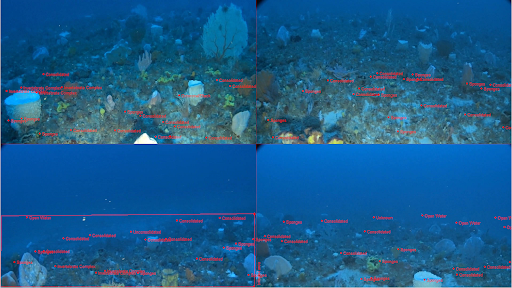
##### Figure 9: Example of a fully annotated panoramic drop camera composite image. The red box in the bottom right image denotes the custom area of interest used to overlay the annotation points in TransectMeasure.

#### 3. Classifying the benthic composition in an image

* Left click on a point to display the “Attribute editor” (Figure 10)
* Select the biota that lies directly underneath the point from the “BROAD” dropdown (includes benthos, un/consolidated substrate, open water and unknown). 

Note: Zoom into an image to analyse the benthic composition more closely by adjusting the "Zoom" value at the top left of the window before holding down the ctrl key and hovering your cursor over the area that you would like to zoom to.

* Continue to populate each dropdown (where possible) after “BROAD” (i.e. “MORPHOLOGY” > “TYPE” ). The “MORPHOLOGY” and “TYPE” drop down options will change depending on which “BROAD” option is chosen . Select “Clear” to reset the dropdowns for all of the categories (Figure 10).
* The dropdown for “Code” is automatically filled by an eight digit code once all possible categories have been selected for that 'rectangle'. Codes are sourced from the CATAMI classification scheme and are dependent on the combination of the first three options selected (i.e. “BROAD”, “MORPHOLOGY” and “TYPE”).
* The dropdown for “FieldOfView” indicates how the camera is positioned when it lands on the substrate. This dropdown includes options for; 
    * Facing Down (No open water visible and the system is facing the benthos/substrate).
    * Facing Up (No substrate visible and the system is facing towards the surface).
    * Limited (Camera system has landed on its side, upside down or the field of view is badly obstructed by benthos or substrate within ~1m of the camera).
    * Open (Camera system has landed upright and level on the substrate with an adequate amount of benthos/substrate available for classification). 
* Relief should not be annotated at this stage, with details on how to annotate relief outlined in the following section (_“4. Classifying the relief of an image”_).

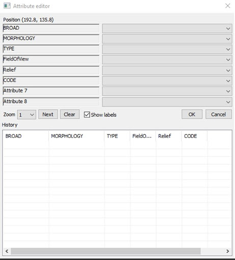
##### Figure 10: The ‘attribute editor’ window within TransectMeasure.

#### 4. Classifying the relief of an image

Annotation of relief will need to be annotated in a separate TransectMeasure file (.TMObs), which can be set up by following the same steps defined in ‘1. Load images and attribute file’. 

* To set up the grid: “Measurements” > “Dot configuration ...”. Set accordingly: Grided dots, ‘Dots across image’ = 5, ’Dots down image’ = 4 and check the “Overlay rectangles” box (Figure 11). This will allow you to classify the relief according to 20 gridded points. You should only need to change these settings the first time you use the program on your computer.
* To overlay the grid: Right click on an image and select “Overlay dots” (Figure 12). The name of the image will then appear in the table to the left of the image. 

NOTE: For composite imagery that consists of multiple images, gridded dot configuration can be changed to reflect multiple images. For panoramic drop camera imagery containing four images, we overlay 10 dots across the image and 8 dots down the image (Figure 14). 

* Left click on a point to display the “Attribute editor” (Figure 15)
* Select the relevant field of view and relief score for the whole rectangle from the “FieldOfView” and “Relief” dropdowns. 
* The dropdown for “FieldOfView” indicates how the camera is positioned when it lands on the substrate. This dropdown includes options for; 
    * Facing Down (No open water visible and the system is facing the benthos).
    * Facing Up (No substrate visible and the system is facing towards the surface).
    * Limited (Camera system has landed on its side, upside down or the field of view is badly obstructed by benthos or substrate within ~1m of the camera).
    * Open (Camera system has landed upright and level on the substrate with an adequate amount of habitat available for classification). 
* The dropdown for “Relief” indicates the structural complexity of the substrate and associated benthos. This dropdown includes six distinct categories adapted from Wilson et al. (2006), which are;
    * **0. **Flat substrate, sandy, rubble with few features. ~0 substrate slope
    * **1. ** Some relief features amongst mostly flat substrate/sand/rubble. &lt;45 degree substrate slope
    * **2. **Mostly relief features amongst some flat substrate or rubble. ~45 substrate slope
    * **3. **Good relief structure with some overhangs. >45 substrate slope
    * **4. **High structural complexity, fissures and caves. Vertical wall. ~90 substrate slope.
    * **5. **Exceptional structural complexity, numerous large holes and caves. Vertical wall. ~90 substrate slope.

NOTE: Any ‘rectangle’ that has some form of benthos/substrate visible should be classified for _Relief _(even if open water makes up the majority of the grid).

##### Figure 11: Setting the dot configuration in TransectMeasure.

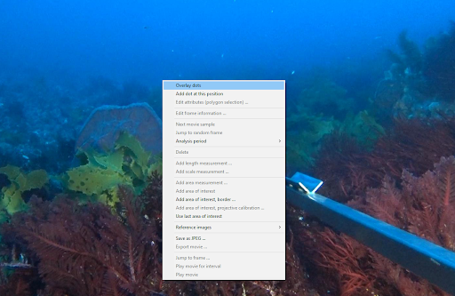
##### Figure 12: Adding dots to an image in TransectMeasure.

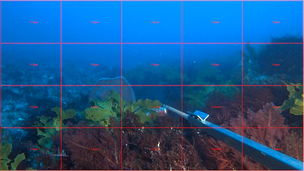
##### Figure 13: Example of a stereo-BRUV image annotated for relief, showing measurements labels for field of view.

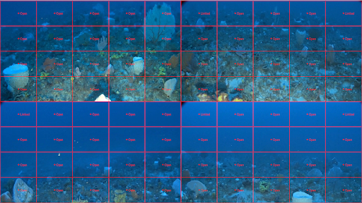
##### Figure 14: Example of a panoramic drop camera composite image annotated for relief, showing annotation labels for field of view.

##### Figure 15: The ‘attribute editor’ window within TransectMeasure.

#### 5. Saving and exporting from TransectMeasure

* To save your work: “Measurements” > “Write to file ...” (Figure 16). This creates a *.TMObs file where your benthic classifications will be saved.
* To export TMObs file: “Program” > “Batch text file output ...” (Figure 17)
* The following box should appear: Double click to the right of the ✓ (under “Data”) in the “Input file directory” row, then locate the folder where your *.TMObs file has been saved, do the same for the “output file directory” to specify the folder location for saving your text file (Figure 18). Now select “Process”. This will generate an output text file that can be processed using the scripts included in the GitHub repository (see ‘Annotation summary and quality control’). 

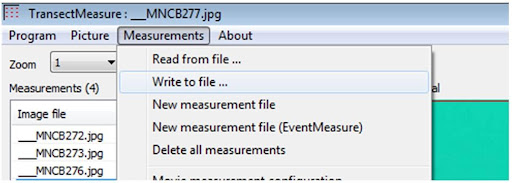
##### Figure 16: Writing to file in TransectMeasure in order to save image observations.

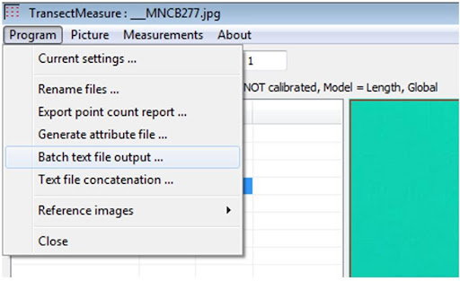
##### Figure 17: The ‘batch text file output’ option in TransectMeasure.

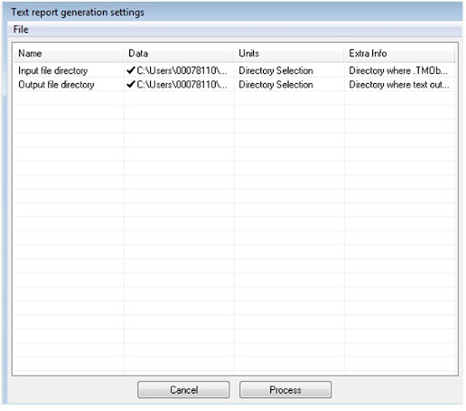
##### Figure 18: Input and output file directory options for batch text file outputs in TransectMeasure.

### Recommended approaches

For standard (rapid) assessment of _Benthic Composition_, _FieldOfView_ and _Relief _we recommend using ONLY the: “BROAD” classification within the _Benthic Composition_ and _FieldOfView_ and _Relief_. An experienced analyst would be able to annotate this schema to over 200 images a day.

**OR**

For detailed assessment of _Benthic Composition_ (where coral bleaching or macroalgae composition was of interest), _FieldOfView_ and _Relief_ we recommend using all the classes in _Benthic Composition_ (“BROAD” > “MORPHOLOGY” > “TYPE” and _FieldOfView_ and _Relief_. An experienced analyst would be able to annotate this schema to over 120 images a day.

Forward facing imagery can be annotated in a range of software, including TransectMeasure from SeaGIS ([seagis.com.au](https://www.seagis.com.au/)), ReefCloud ([reefcloud.ai](http://reefcloud.ai)), CoralNet ([coralnet.ucsd.edu](https://coralnet.ucsd.edu/)), and Squidle+ ([squidle.org](https://squidle.org/)). 

#### Annotation summary and quality control

All corrections should be made within the original annotation files to ensure data consistency over time. We recommend the following approaches to ensure quality control:

* Check that _FieldOfView_, _Relief_ and _Benthic Composition_ have been entered for every successful deployment (see R scripts included in the GitHub repository- ‘[forward-facing-benthic-composition-annotation](https://github.com/UWA-Marine-Ecology-Group-projects/forward-facing-benthic-composition-annotation)’).
* Check that the image names match the metadata sample names.
* Check all successful deployments have benthic composition data.

#### Examples of publications that have used this or earlier versions of this SOP

1.	Wilson, S. K. et al. Multiple disturbances and the global degradation of coral reefs: are reef fishes at risk or resilient? Glob. Chang. Biol. 12, 2220–2234 (2006).
2.	McLean, D. L. et al. Distribution, abundance, diversity and habitat associations of fishes across a bioregion experiencing rapid coastal development. Estuarine, Coastal and Shelf Science 178, 36–47 (2016).
3.	McLean, D. L. et al. Using industry ROV videos to assess fish associations with subsea pipelines. Cont. Shelf Res. 141, 76–97 (2017).
4.	Bond, T. et al. The influence of depth and a subsea pipeline on fish assemblages and commercially fished species. PLoS One 13, e0207703 (2018).
5.	Bond, T. et al. Fish associated with a subsea pipeline and adjacent seafloor of the North West Shelf of Western Australia. Mar. Environ. Res. 141, 53-65 (2018).
6.	Bond, T. et al. Diel shifts and habitat associations of fish assemblages on a subsea pipeline. Fish. Res. 206, 220–234 (2018).
7.	Lester, E. et al. Drivers of variation in occurrence, abundance, and behaviour of sharks on coral reefs. Sci. Rep. 12, 728 (2022).
8.	Lester, E. et al. Relative influence of predators, competitors and seascape heterogeneity on behaviour and abundance of coral reef mesopredators. Oikos 130, 2239–2249 (2021).
9.	Rolim, F. A. et al. Network of small no-take marine reserves reveals greater abundance and body size of fisheries target species. PLoS One 14, e0204970 (2019).
10.	Rolim, F. A. et al. Baited videos to assess semi-aquatic mammals: occurrence of the neotropical otter Lontra longicaudis (Carnivora: Mustelidae) in a marine coastal island in São Paulo, Southeast Brazil. Mar. Biodivers. 49, 1047-1051 (2018).
11.	Haberstroh, A. J. et al. Baited video, but not diver video, detects a greater contrast in the abundance of two legal-size target species between no-take and fished zones. Mar. Biol. 169, 79 (2022).
12.	Piggott, C. V. H. et al. Remote video methods for studying juvenile fish populations in challenging environments. J. Exp. Mar. Bio. Ecol. 532, 151454 (2020).
13.	MacNeil, M. A. et al. Global status and conservation potential of reef sharks. Nature 583, 801–806 (2020).
14.	Goetze, J. S. et al. Drivers of reef shark abundance and biomass in the Solomon Islands. PLoS One 13, e0200960 (2018).
